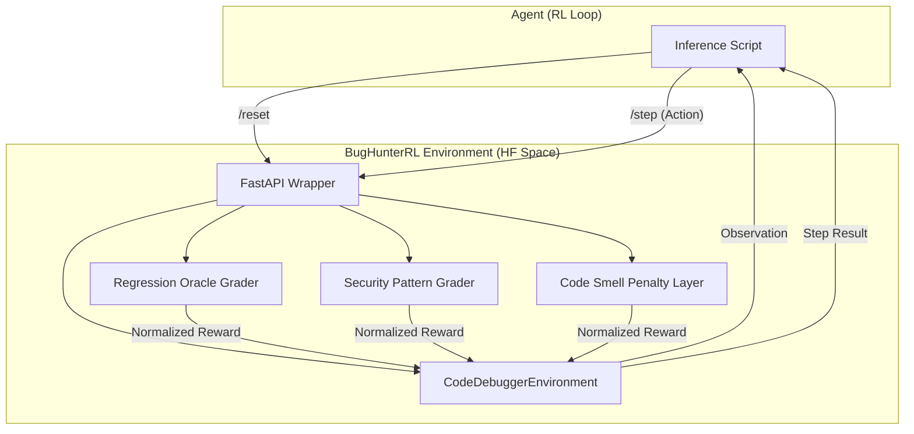

# BugHunterRL: Reinforcement Learning for Automated Code Debugging


**BugHunterRL (code-debugger-env)** is a production-grade OpenEnv environment designed for training and evaluating RL agents on real-world Python debugging and security auditing tasks. It bridges the gap between synthetic benchmarks and the complexities of actual software development, featuring tiered difficulty levels, project-level logic simulations, and automated security grading.

---

## 🌟 Why This Matters for Meta × PyTorch

BugHunterRL directly supports the mission of **Automated Software Engineering (ASE)** and **AI-Assisted Programming**. 

1.  **PyTorch Training Loops**: The environment is highly optimized for integration with PyTorch-based RL frameworks (like `torchrl` or `StableBaselines3`).
2.  **Llama-Family Support**: Designed for fine-tuning agents (like **Meta Llama 3.1 8B**) to recognize subtle logic flaws and security vulnerabilities (SQLi, Command Injection) that traditional linters miss.
3.  **Cross-Module Logic**: Our "Hard" tasks simulate multi-file project dependencies, pushing agents beyond single-line fixes toward architectural understanding.

---

## 🏗️ Architecture



---

## 🚀 Getting Started

### 1. Requirements
- Python 3.10+
- `openenv-core>=0.2.1`

### 2. Fast Setup
```bash
git clone https://huggingface.co/spaces/raunit19/code-debugger-env
cd code-debugger-env
pip install -r requirements.txt
```

### 3. Run the Environment Locally
```bash
# Serves the environment on port 7860
python server/app.py
```

### 4. Run Baseline Inference
Our baseline uses the native OpenAI-compatible client to call Meta Llama models.
```bash
export API_BASE_URL="https://router.huggingface.co/v1"
export MODEL_NAME="meta-llama/Llama-3.1-8B-Instruct"
export HF_TOKEN="your_hf_token"
export ENV_BASE_URL="http://localhost:7860"

python inference.py
```

---

## 📊 Evaluation Design

BugHunterRL implements a **Double-Layer Grading System**:

| Component | Logic | Impact |
| :--- | :--- | :--- |
| **Regression Oracle** | Compares `failing_tests` (must pass) vs `passing_tests` (must not break). | core scoring |
| **Security Pattern** | Regex-based detection of dangerous sinks or missing sanitizers. | hard task validation |
| **Code Smell Penalty** | AST-based detection of `eval()`, `exec()`, or bare `except: pass`. | -40% score penalty |

Scores are strictly normalized to **(0.001, 0.999)** to ensure deterministic evaluation and compliance with Phase-2 validator constraints.

---

## 🛠️ Task Categories

1.  **Easy**: Simple logic fixes (off-by-one errors, indexing).
2.  **Medium**: Algorithmic bugs (recursion depth, list flattening logic).
3.  **Hard**: Security Auditing (SQL Injection, Command Injection, Weak Hashing) and **Multi-File Project Simulation**.

---

## 🔒 Security & Optimization
- **Restricted Sandbox**: Grader runs submitted code in a restricted `exec()` sandbox with limited built-ins.
- **2vCPU / 8GB Optimized**: The entire environment uses <200MB RAM and initializes in <2s, ideal for high-throughput RL training.
- **Multimodal Ready**: Provides full task metadata via the `/metadata` and `/stats` endpoints.

---

Generated for the **Meta × PyTorch OpenEnv Hackathon @ Scaler**.
Developer: [raunit19](https://huggingface.co/raunit19)
