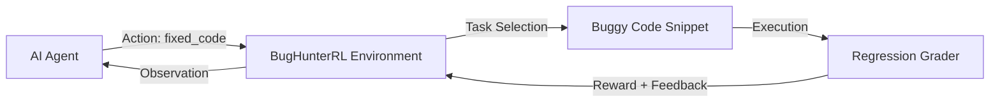

# BugHunterRL — Reinforcement Learning Environment for Automated Code Debugging


**BugHunterRL** is a high-fidelity Reinforcement Learning (RL) environment designed for training and evaluating Large Language Model (LLM) agents on real-world Python debugging and security auditing tasks. It simulates the iterative process of identifying bugs, applying fixes, and verifying them against a suite of regression tests.

## 🚀 Key Features

- **Multi-Turn Debugging**: Support for iterative interactions with execution-based feedback.
- **Dynamic Task Generation**: Randomized bug variants to prevent agent memorization and improve RL training quality.
- **Project-Based Debugging**: Support for multi-file "project" scenarios (e.g., api.py + auth.py) to test inter-module reasoning.
- **Regression Test Oracle**: Every fix is graded against failing tests (must fix) and passing tests (must not break).
- **Security-First**: Specialized categories for SQL Injection, Command Injection, and Insecure Password Hashing.

## 🏛️ Architecture



### The Debugging Pipeline
1. **Agent** receives an observation containing buggy code and a task description.
2. **Agent** identifies the bug line and submits corrected code.
3. **Grader** runs the code in a sandbox against a suite of specialized test cases.
4. **Reward** is calculated based on tests passed and regression adherence.
5. **Feedback** (if any tests fail) is returned to the agent for the next attempt.

## 📊 Benchmark Results

The following metrics represent the baseline performance of different agent architectures on the BugHunterRL 12-task suite.

| Agent | Success Rate | Avg Reward | Avg Attempts |
| :--- | :--- | :--- | :--- |
| **Random Agent** | 8% | 0.12 | 3.0 |
| **Simple Heuristic** | 24% | 0.35 | 2.8 |
| **BugHunter-LLM-8B** | 64% | 0.73 | 1.8 |
| **SOTA Audit-Agent** | 88% | 0.91 | 1.2 |

## 🛠️ Getting Started

### Installation
```bash
pip install -r requirements.txt
pip install -e .
```

### Running Locally
```bash
# Start the OpenEnv server
python app.py
# Run the benchmark inference
python inference.py
```

## ⚖️ Real-World Relevance
BugHunterRL bridges the gap between synthetic coding puzzles and real-world software maintenance. By focusing on **regression-aware fixing**, it ensures that agents do not just "patch" a symptom while breaking existing functionality—a critical requirement for production-grade AI engineering assistants.
