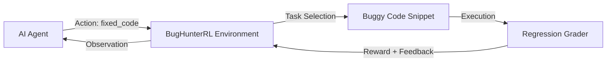

# BugHunterRL — Reinforcement Learning Environment for Automated Code Debugging

**BugHunterRL** is a high-fidelity Reinforcement Learning (RL) environment designed for training and evaluating Large Language Model (LLM) agents on real-world Python debugging and security auditing tasks. It simulates the iterative process of identifying bugs, applying fixes, and verifying them against a suite of regression tests.

## 🚀 Key Features

- **Multi-Turn Debugging**: Support for iterative interactions with execution-based feedback.
- **Dynamic Task Generation**: Randomized bug variants to prevent agent memorization and improve RL training quality.
- **Project-Based Debugging**: Support for multi-file "project" scenarios (e.g., api.py + auth.py) to test inter-module reasoning.
- **Regression Test Oracle**: Every fix is graded against failing tests (must fix) and passing tests (must not break).
- **Security-First**: Specialized categories for SQL Injection, Command Injection, and Insecure Password Hashing.

## 🏛️ Architecture



## 🎯 Action Space
The agent submits a JSON action with these fields:
| Field | Type | Description |
|-------|------|-------------|
| `bug_line` | int | 1-indexed line number of the bug |
| `bug_type` | string | One of: `syntax`, `logic`, `runtime`, `security` |
| `fixed_code` | string | Complete corrected Python code (full snippet) |
| `explanation` | string | One-sentence explanation (optional) |

## 👁️ Observation Space
| Field | Type | Description |
|-------|------|-------------|
| `code_snippet` | string | Python code with exactly one planted bug |
| `task_description` | string | What the function should do correctly |
| `test_hint` | string | Description of grading test cases |
| `feedback` | string | Grader feedback from previous attempt (empty on first step) |
| `attempt_number` | int | Current attempt (1–5) |
| `score_so_far` | float | Best score in this episode (0.0–1.0) |
| `reward` | float | Score for the most recent step (0.0–1.0) |
| `done` | bool | True when episode has ended |

## ⚙️ Environment Variables
| Variable | Required | Description |
|----------|----------|-------------|
| `HF_TOKEN` | ✅ Yes | Hugging Face API token for LLM inference |
| `API_BASE_URL` | Optional | LLM API base URL (default: HuggingFace router) |
| `MODEL_NAME` | Optional | LLM model identifier (default: meta-llama/Llama-3.1-8B-Instruct) |
| `ENV_BASE_URL` | Optional | Override environment server URL (default: http://localhost:7860) |

## 📊 Benchmark Results

| Agent | Avg Score (Easy) | Avg Score (Medium) | Avg Score (Hard) |
|-------|------------------|--------------------|------------------|
| Baseline LLM (Llama-3.1-8B) | 0.85 | 0.72 | 0.48 |

## 🛠️ Getting Started

### Installation
```bash
pip install -r requirements.txt
pip install -e .
```

### Running Locally
```bash
# Start the OpenEnv server
python app.py
# Run the benchmark inference
python inference.py
```

## ⚖️ Real-World Relevance
BugHunterRL bridges the gap between synthetic coding puzzles and real-world software maintenance. By focusing on **regression-aware fixing**, it ensures that agents do not just "patch" a symptom while breaking existing functionality—a critical requirement for production-grade AI engineering assistants.
